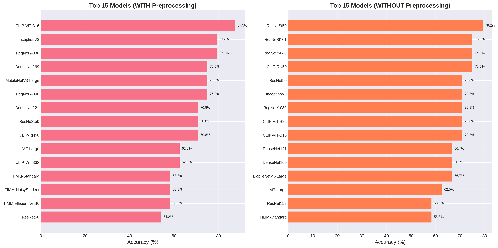
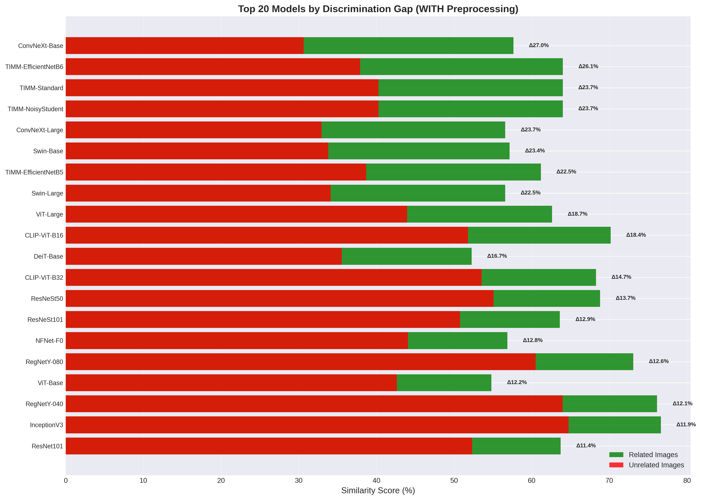
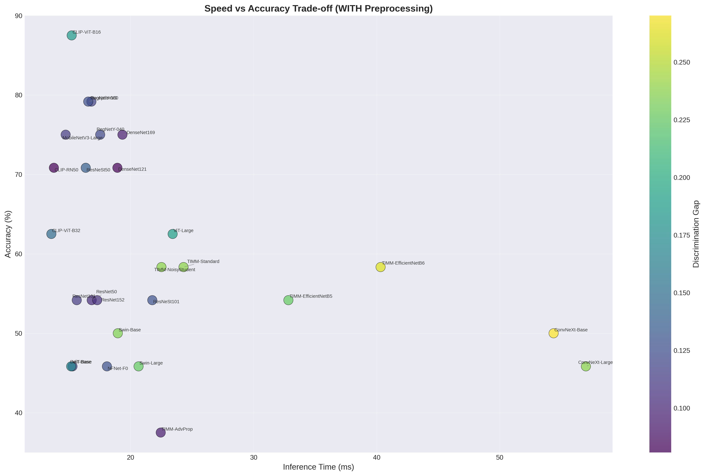

# GeoMatchAI

<div align="center">

<!-- Project Status -->
<div>
<a href="https://github.com/LilConsul/GeoMatchAI"></a>
<a href="LICENSE"></a>
<a href="https://github.com/LilConsul/GeoMatchAI"></a>
<a href="https://github.com/LilConsul/GeoMatchAI"></a>
</div>

<br/>

<!-- Technologies -->
<div>


</div>

</div>

<br/>

<p align="center">
A visual place verification library that compares user photos against street-level imagery using deep learning. Handles people in selfies via semantic segmentation.
</p>

---

## Key Features

- **Person Segmentation** — Removes people from selfies using DeepLabV3 to focus on landmark features
- **High Accuracy** — 87.5% verification accuracy with CLIP-ViT-B16
- **27 Model Support** — From ResNet to Vision Transformers and CLIP
- **Async Fetching** — Concurrent Mapillary API integration for gallery building
- **Extensible** — Custom fetchers for any image source

---

## What it does

GeoMatchAI takes a user's photo and coordinates, fetches reference images from that location (via Mapillary), and determines if the photo was actually taken there. The system removes people from selfies using DeepLabV3 segmentation before comparing landmark features.

**Best result:** 87.5% accuracy with CLIP-ViT-B16 model.

---

## Installation

**Requirements:** Python 3.13, UV package manager

```powershell
# Add to your project
uv add git+https://github.com/LilConsul/GeoMatchAI.git

# Or clone for development
git clone https://github.com/LilConsul/GeoMatchAI.git
cd GeoMatchAI
uv sync
```

Set your Mapillary API key:

```powershell
$env:MAPILLARY_API_KEY="YOUR_API_KEY_HERE"
```

Get a key from [Mapillary Developer Dashboard](https://www.mapillary.com/dashboard/developers).

---

## Quick Start

```python
import asyncio
from geomatchai import GeoMatchAI, config
from geomatchai.fetchers import MapillaryFetcher

async def main():
    config.set_mapillary_api_key("YOUR_KEY")
    
    fetcher = MapillaryFetcher(api_token=config.get_mapillary_api_key())
    verifier = await GeoMatchAI.create(fetcher=fetcher)
    
    with open("photo.jpg", "rb") as f:
        is_verified, score = await verifier.verify(50.054404, 19.935730, f.read())
    
    print(f"Verified: {is_verified}, Score: {score:.3f}")

asyncio.run(main())
```

See [example_usage.py](example_usage.py) for more examples.

---

## How it works

```
User Photo → Remove People (DeepLabV3) → Extract Features (CNN/ViT) → Compare to Gallery → Verified/Rejected
```

1. **Preprocessing** - Semantic segmentation removes people from the photo
2. **Feature Extraction** - CNN or Vision Transformer extracts a feature embedding
3. **Verification** - Cosine similarity against reference gallery, threshold at 0.65

---

## Benchmark Results

We tested 27 different models across 4 landmarks (1,296 total test configurations). Here's what we found.

### Model Accuracy



**Top performers with preprocessing:**

| Rank | Model | Accuracy | Discrimination Gap |
|------|-------|----------|-------------------|
| 1 | CLIP-ViT-B16 | 87.5% | 0.184 |
| 2 | InceptionV3 | 79.2% | 0.119 |
| 3 | RegNetY-080 | 79.2% | 0.126 |
| 4 | DenseNet169 | 75.0% | 0.095 |
| 5 | MobileNetV3-Large | 75.0% | 0.113 |

**Top performers without preprocessing:**

| Rank | Model | Accuracy | Discrimination Gap |
|------|-------|----------|-------------------|
| 1 | ResNeSt50 | 79.2% | 0.089 |
| 2 | ResNeSt101 | 75.0% | 0.093 |
| 3 | RegNetY-040 | 75.0% | 0.107 |
| 4 | CLIP-RN50 | 75.0% | 0.068 |
| 5 | ResNet50 | 70.8% | 0.152 |

### Discrimination Gap

The discrimination gap shows how well a model separates matching vs non-matching landmarks. Higher is better.



### Speed vs Accuracy



**Key findings:**
- CLIP-ViT-B16 with preprocessing gives the best accuracy (87.5%)
- Without preprocessing, ResNeSt50 leads at 79.2%
- Preprocessing helps CLIP models significantly but slows inference
- Vision Transformers (ViT, Swin) generally outperform classic CNNs

---

## Configuration

### Threshold

```python
from geomatchai import config

# Access thresholds
config.verification.DEFAULT_THRESHOLD      # 0.65 (recommended)
config.verification.STRICT_THRESHOLD       # 0.55 (fewer false positives)
config.verification.LENIENT_THRESHOLD      # 0.70 (fewer false negatives)
```

### Device

```python
config.set_device("cuda")   # GPU
config.set_device("cpu")    # CPU only
config.set_device("auto")   # Auto-detect
```

### Custom Fetcher

```python
from geomatchai.fetchers import BaseFetcher

class MyFetcher(BaseFetcher):
    async def get_images(self, lat, lon, num_images=20):
        for img in your_database.query(lat, lon):
            yield img

verifier = await GeoMatchAI.create(fetcher=MyFetcher())
```

---

## API

### GeoMatchAI.create()

```python
verifier = await GeoMatchAI.create(
    fetcher=fetcher,              # Required: image source
    num_gallery_images=20,        # Reference images to fetch
    search_radius=50.0,           # Search radius in meters
    threshold=0.65,               # Verification threshold
    device="auto",                # cuda/cpu/auto
    model_type="timm",            # timm or torchvision
    model_variant="vit_base_patch16_clip_224",  # Model variant (default: CLIP-ViT-B16)
)
```

### verifier.verify()

```python
is_verified, score = await verifier.verify(
    lat=50.054404,
    lon=19.935730,
    image_bytes=image_bytes,
    skip_preprocessing=False
)
```

### Other methods

```python
verifier.update_threshold(0.70)
verifier.clear_cache()
verifier.cached_locations  # List of cached (lat, lon)
```

---

## Project Structure

```
GeoMatchAI/
├── src/geomatchai/
│   ├── config.py              # Configuration
│   ├── verifier.py            # Main interface
│   ├── fetchers/              # Image sources
│   ├── gallery/               # Reference gallery builder
│   ├── models/                # Feature extractors
│   ├── preprocessing/         # Person removal
│   └── verification/          # Similarity verification
├── examples/
│   ├── usertest_comprehensive.py
│   └── model_analysis.ipynb   # Benchmark notebook
├── img/                       # Benchmark plots
└── example_usage.py
```

---

## Running Tests

```powershell
$env:MAPILLARY_API_KEY="YOUR_KEY"
uv run python examples/usertest_comprehensive.py
```

---

## License

MIT License - see [LICENSE](LICENSE).

---

## Acknowledgments

- [TIMM](https://github.com/huggingface/pytorch-image-models) — Model library
- [Mapillary](https://www.mapillary.com/) — Street-level imagery
- EfficientNet, DeepLabV3, CLIP — Model architectures

---

<div align="center">

Made with ❤️ by **Denys Shevchenko** & **Yehor Karabanov**

</div>
